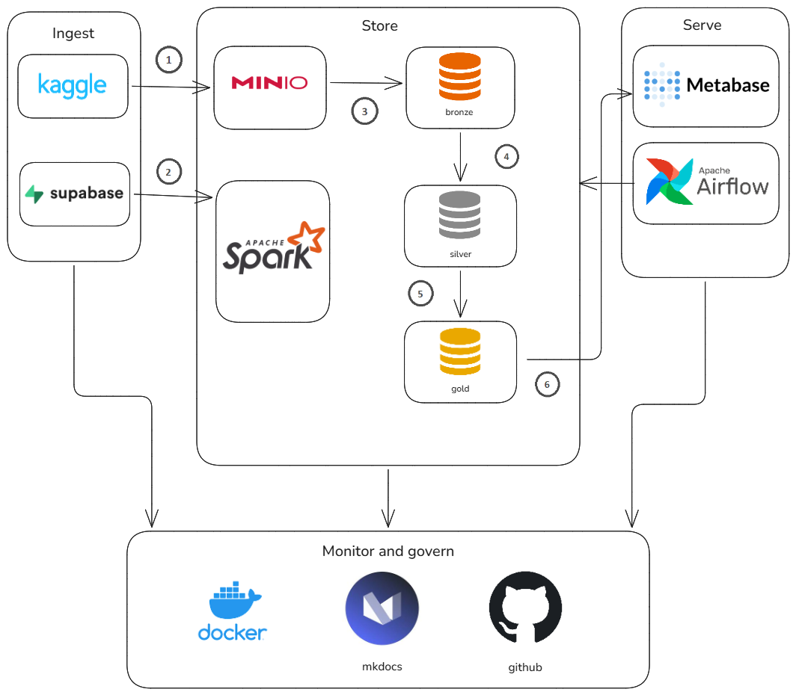

# Projeto Final - Engenharia de Dados SATC

<!--[](https://octaviodemos.github.io/projeto-final-ed/) -->
[](LICENSE)
[](https://www.python.org/)
[](https://spark.apache.org/docs/latest/api/python/)
[](https://delta.io/)
[](https://min.io/)
[](https://docs.docker.com/compose/)
[](https://airflow.apache.org/)
[](https://trino.io/)
[](https://supabase.com/)
[](https://papermill.readthedocs.io/)
[](https://www.metabase.com/)
[](https://www.mkdocs.org/)
[](https://docs.astral.sh/uv/)

Repositório do projeto final da disciplina de Engenharia de Dados do curso de Engenharia de Software da UNISATC.

## Desenho de Arquitetura



## Pré-requisitos e ferramentas utilizadas

- **Linguagem:** Python 3.11+
- **Armazenamento:** MinIO (compatível com S3)
- **Processamento:** PySpark + Delta Lake
- **Orquestração de jobs:** Apache Airflow + Papermill
- **Orquestração local:** Docker Compose
- **Banco de dados:** Supabase (PostgreSQL) — fonte única de dados do projeto
- **Query Engine:** Trino — virtualiza as tabelas Delta Lake da camada Gold para o Metabase
- **Visualização:** Metabase
- **Documentação:** MkDocs + mkdocs-material
- **Gerenciador de dependências:** uv

## Instalação e Execução

O projeto utiliza o **`uv`** como gerenciador de dependências rápido e moderno.

### 1. Clonar o repositório

```bash
git clone https://github.com/octaviodemos/projeto-final-ed.git
cd projeto-final-ed
```

### 2. Configurar o ambiente

Sincronize as dependências e baixe os JARs necessários para que o PySpark se conecte ao MinIO via protocolo S3A.

```bash
uv sync
uv run python scripts/setup_jars.py
cp .env.example .env
```

> **Nota**: Edite o arquivo `.env` para incluir suas credenciais do Kaggle (`KAGGLE_USERNAME` e `KAGGLE_KEY`).

### 3. Subir a infraestrutura (MinIO, Airflow, Trino e Metabase)

```bash
cd docker
docker compose --env-file ../.env up -d
cd ..
```

| Serviço  | Endereço               |
|----------|------------------------|
| MinIO    | http://localhost:9000  |
| Airflow  | http://localhost:8080  |
| Trino    | http://localhost:8080  |
| Metabase | http://localhost:3000  |

### 4. Ingestão — Camada Landing

**4a. Download do dataset Olist (CSV → MinIO Landing)**

```bash
uv run python scripts/ingest/landing_ingest.py
```

### 5. Processamento — Camada Bronze

**5a. CSVs Olist → Bronze**

```bash
uv run papermill notebooks/01a_landing_to_bronze.ipynb output.ipynb \
    -p landing_bucket landing \
    -p bronze_bucket bronze
```

> Os notebooks também podem ser executados manualmente via Jupyter ou orquestrados pelo Airflow em `http://localhost:8080`.

### 6. Processamento — Camada Silver

**6a. Bronze → Silver**

```bash
uv run papermill notebooks/02_bronze_to_silver.ipynb output.ipynb \
    -p bronze_bucket bronze \
    -p silver_bucket silver
```

### 7. Processamento — Camada Gold

**7a. Silver → Gold**

```bash
uv run papermill notebooks/03_silver_to_gold.ipynb output.ipynb \
    -p silver_bucket silver \
    -p gold_bucket gold
```

## Documentação (MkDocs)

Toda a documentação está em `docs/`:

```bash
uv run mkdocs build
uv run mkdocs serve
```

Acesse o site em [Documentação MkDocs](https://octaviodemos.github.io/projeto-final-ed/).

Para publicar no GitHub Pages:

```bash
uv run mkdocs gh-deploy
```

## Colaboração

1. Abra uma **issue** para discutir sua feature ou bug.
2. Crie um **branch**:

   ```bash
   git checkout -b feature/nome-da-sua-feature
   ```

3. Faça suas alterações e **commit** seguindo o [Conventional Commits](https://www.conventionalcommits.org/en/v1.0.0/).
4. Envie um **pull request** para `main`.
5. Aguarde revisão e merge.

## Autores

* **Ana Laura Vicenzi Dordete** - *Engenharia de Dados, Data Quality e Transformações da Camada Silver* - [https://github.com/anaavicenzi](https://github.com/anaavicenzi)

* **Gabriel Ribeiro Fernandes** - *Orquestração de Pipelines e Automação do Fluxo de Dados* - [https://github.com/gabrielribbz](https://github.com/gabrielribbz)

* **Ismael Damasceno Tristão** - *Modelagem Dimensional (Kimball) e Camada Gold* - [https://github.com/IsmaelDamasceno](https://github.com/IsmaelDamasceno)

* **João Vitor de Oliveira Lima** - *Conversão Landing → Bronze e Estruturação do Data Lake* - [https://github.com/JoaoVitorOL](https://github.com/JoaoVitorOL)

* **Luiz Fillipy Vefago Binatti** - *Business Intelligence, Metabase e Dashboards Analíticos* - [https://github.com/luizzzxq](https://github.com/luizzzxq)

* **Octávio da Silva Demos** - *Coordenação do Projeto, Gestão das Issues e Integração da Solução* - [https://github.com/octaviodemos](https://github.com/octaviodemos)

* **Vinícius Pedroso Milanez** - *Documentação, MkDocs e Publicação no GitHub Pages* - [https://github.com/viniciusmilanez](https://github.com/viniciusmilanez)

## Licença

Este projeto está sob a licença MIT - veja o arquivo [LICENSE](LICENSE) para detalhes.
[](LICENSE)

## Referências

### Projeto base

- [projeto-ed-satc](https://github.com/jlsilva01/projeto-ed-satc) — repositório modelo do professor
- [Canal DataWay BR no YouTube](https://www.youtube.com/@DataWayBR)
- Material das aulas de Engenharia de Dados - Prof. Jorge Luiz da Silva - UNISATC

### Dataset

- [Brazilian E-Commerce Public Dataset by Olist — Kaggle](https://www.kaggle.com/datasets/olistbr/brazilian-ecommerce) — dataset utilizado no projeto

### Arquitetura Medallion e Data Lakes

- [Databricks — What is the Medallion Architecture?](https://www.databricks.com/glossary/medallion-architecture) — definição oficial da arquitetura Bronze/Silver/Gold
- [Delta Lake — Documentation](https://docs.delta.io/latest/index.html) — documentação oficial do Delta Lake, incluindo ACID transactions e schema enforcement

### PySpark e Processamento Distribuído

- [Apache Spark — PySpark Documentation](https://spark.apache.org/docs/latest/api/python/) — referência oficial da API PySpark

### MinIO e Armazenamento

- [MinIO — Documentation](https://min.io/docs/minio/linux/index.html) — documentação oficial do MinIO

### Query Engine

- [Trino — Documentation](https://trino.io/docs/current/) — documentação oficial do Trino
- [Trino — Delta Lake Connector](https://trino.io/docs/current/connector/delta-lake.html) — conector utilizado para virtualizar as tabelas Delta Lake da camada Gold

### Orquestração

- [Apache Airflow — Documentation](https://airflow.apache.org/docs/) — documentação oficial do Airflow
- [Papermill — Documentation](https://papermill.readthedocs.io/en/latest/) — execução parametrizada de Jupyter Notebooks