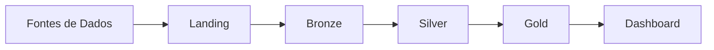

# Arquitetura

Descreva aqui a arquitetura geral do projeto de engenharia de dados.

## Visão geral

Inclua um diagrama da arquitetura utilizando Mermaid ou uma imagem em `assets/`.

## Componentes

| Componente | Tecnologia | Descrição |
|------------|------------|-----------|
| Armazenamento | MinIO | Object storage compatível com S3 |
| Processamento | PySpark | Transformações nas camadas medallion |
| Visualização | Metabase | Dashboards e análises |
