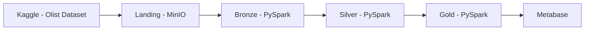

# Arquitetura

Este projeto implementa uma pipeline de engenharia de dados baseada na arquitetura Medallion, utilizando o dataset de e-commerce da Olist como fonte de dados. O fluxo contempla ingestão, armazenamento, transformação e disponibilização dos dados para análise.

## Visão geral

### Fluxo de dados

1. Os dados são extraídos do Kaggle.
2. Os arquivos CSV são armazenados na camada Landing no MinIO.
3. A camada Bronze realiza padronizações iniciais e controle de qualidade.
4. A camada Silver aplica transformações de negócio e integração entre conjuntos de dados.
5. A camada Gold disponibiliza tabelas analíticas otimizadas para consumo.
6. O Metabase consome os dados da camada Gold para geração de dashboards.

## Componentes

| Componente     | Tecnologia      | Descrição                                 |
| -------------- | --------------- | ----------------------------------------- |
| Fonte de Dados | Kaggle          | Dataset público de e-commerce da Olist    |
| Armazenamento  | MinIO           | Data Lake compatível com S3               |
| Processamento  | PySpark         | Transformações e enriquecimento dos dados |
| Landing        | MinIO           | Armazenamento dos dados brutos            |
| Bronze         | PySpark + MinIO | Padronização inicial dos dados            |
| Silver         | PySpark + MinIO | Limpeza e integração dos datasets         |
| Gold           | PySpark + MinIO | Camada analítica para consumo             |
| Visualização   | Metabase        | Dashboards e análises de negócio          |
| Orquestração   | Airflow         | Agendamento e automação dos pipelines     |
| Ambiente       | Docker Compose  | Orquestração dos serviços locais          |

## Estrutura das Camadas

### Landing

Armazena os arquivos originais extraídos do Kaggle sem qualquer transformação.

### Bronze

Contém os dados convertidos para um formato padronizado e preparados para processamento.

### Silver

Armazena dados tratados, limpos e integrados, servindo como base para análises.

### Gold

Disponibiliza datasets analíticos e métricas de negócio utilizados pelos dashboards.
