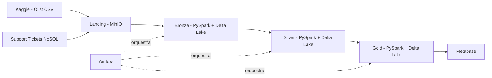

# Arquitetura

Este projeto implementa uma pipeline de engenharia de dados baseada na arquitetura **Medallion**, utilizando duas fontes de dados complementares: o dataset de e-commerce da Olist e um conjunto de support tickets NoSQL. O fluxo contempla ingestão, armazenamento, transformação e disponibilização dos dados para análise.

---

## Visão Geral



---

## Fontes de Dados

O projeto combina duas origens distintas na camada Landing:

### Dataset Olist (CSV)

Conjunto público de e-commerce brasileiro disponibilizado no Kaggle, com aproximadamente 100 mil pedidos reais entre 2016 e 2018. Composto por 9 arquivos CSV com informações sobre pedidos, clientes, produtos, vendedores, pagamentos, avaliações e geolocalização.

### Support Tickets NoSQL (JSON)

Conjunto complementar de dados sintéticos que simula tickets de suporte ao cliente, gerados com base nos `order_id` e `customer_id` reais do Olist. Adiciona informações operacionais não presentes nas tabelas relacionais, como canal de atendimento, prioridade, SLA, agente responsável e histórico de mensagens.

> O arquivo é nomeado `reviews_nosql.json` para manter compatibilidade com o restante da pipeline.

---

## Fluxo de Dados

1. Os dados CSV do Olist são extraídos do Kaggle e armazenados na camada **Landing** no MinIO.
2. Os support tickets NoSQL são gerados sinteticamente (ou exportados do Supabase) e armazenados também na camada **Landing**.
3. A camada **Bronze** lê ambas as fontes via PySpark, adiciona metadados de rastreabilidade e persiste em Delta Lake.
4. A camada **Silver** aplica limpeza, tipagem, integração entre os datasets e transformações de negócio.
5. A camada **Gold** disponibiliza tabelas analíticas e métricas otimizadas para consumo.
6. O **Metabase** consome os dados da camada Gold para geração de dashboards interativos.
7. O **Airflow** orquestra o agendamento e a automação de todos os jobs de processamento.

---

## Componentes

| Componente | Tecnologia | Descrição |
|---|---|---|
| Fonte relacional | Kaggle | Dataset público de e-commerce da Olist (CSV) |
| Fonte NoSQL | Supabase / geração sintética | Support tickets vinculados aos pedidos Olist (JSON) |
| Armazenamento | MinIO | Data Lake compatível com S3 |
| Processamento | PySpark + Delta Lake | Transformações, validações e persistência em camadas |
| Orquestração | Apache Airflow | Agendamento e automação dos pipelines |
| Ambiente local | Docker Compose | Orquestração dos serviços (MinIO, Airflow, Metabase) |
| Visualização | Metabase | Dashboards e análises de negócio |
| Documentação | MkDocs Material | Documentação técnica do projeto |

---

## Estrutura das Camadas

### Landing

Armazena os dados brutos sem nenhuma transformação, preservando o formato original de cada fonte.

```
landing/
├── olist/
│   └── YYYY-MM-DD/
│       └── *.csv          ← 9 arquivos do dataset Olist
└── nosql/
    └── YYYY-MM-DD/
        └── reviews_nosql.json   ← support tickets
```

### Bronze

Converte os dados brutos para Delta Lake, adiciona metadados de ingestão (`_ingestion_timestamp`, `_source_file`) e executa validações de qualidade. Nenhuma transformação de negócio é aplicada nesta etapa.

```
bronze/
├── olist_orders_dataset/
├── olist_customers_dataset/
├── olist_products_dataset/
├── ... (demais tabelas Olist)
└── reviews_nosql/          ← support tickets em Delta Lake
```

### Silver

Aplica limpeza, padronização de tipos, tratamento de nulos e integração entre os datasets relacionais e os support tickets. Serve como base confiável para a camada analítica.

### Gold

Disponibiliza datasets analíticos e métricas de negócio em formato otimizado para consulta, consumidos diretamente pelo Metabase para geração de dashboards.

---

## Decisões de Design

**Por que Delta Lake?**
O Delta Lake oferece suporte a transações ACID, versionamento de schema e integração nativa com PySpark, tornando-o ideal para garantir consistência entre as camadas da arquitetura Medallion.

**Por que MinIO?**
O MinIO é compatível com a API S3 da AWS, permitindo que o projeto simule um ambiente de Data Lake em nuvem rodando completamente de forma local via Docker.