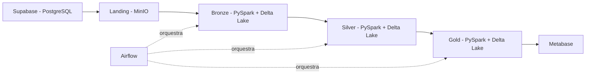

# Arquitetura

Este projeto implementa uma pipeline de engenharia de dados baseada na arquitetura **Medallion**. O **Supabase (PostgreSQL)** é a única fonte de verdade — todos os dados das camadas medalhão (Landing, Bronze, Silver e Gold) têm origem no banco do Supabase. O fluxo contempla ingestão, armazenamento, transformação e disponibilização dos dados para análise.

---

## Visão Geral



---

## Fonte de Dados

O projeto utiliza o **Supabase (PostgreSQL)** como única origem de dados, contendo 12 tabelas:

- **9 tabelas do dataset Olist** — dados públicos de e-commerce brasileiro com aproximadamente 100 mil pedidos reais entre 2016 e 2018, cobrindo pedidos, clientes, produtos, vendedores, pagamentos, avaliações e geolocalização.
- **3 tabelas sintéticas geradas com Faker** — simulam a operação de suporte ao cliente vinculada aos pedidos Olist:
  - `agents` — agentes de suporte (50 agentes, 10 por equipe)
  - `support_tickets` — tickets de atendimento com canal, prioridade, SLA e resolução
  - `support_ticket_messages` — histórico de mensagens por ticket

---

## Fluxo de Dados

1. Os scripts `generate_agents.py` e `generate_support_tickets_nosql.py` populam as tabelas sintéticas no Supabase.
2. O notebook `00_download_olist.ipynb` conecta ao Supabase, extrai as 12 tabelas como CSV e faz upload para a camada **Landing** no MinIO.
3. A camada **Bronze** lê os 12 CSVs via PySpark, adiciona metadados de rastreabilidade e persiste em Delta Lake.
4. A camada **Silver** aplica limpeza, tipagem, integração entre os datasets e transformações de negócio.
5. A camada **Gold** disponibiliza tabelas analíticas e métricas otimizadas para consumo.
6. O **Metabase** consome os dados da camada Gold para geração de dashboards interativos.
7. O **Airflow** orquestra o agendamento e a automação de todos os jobs de processamento.

---

## Componentes

| Componente | Tecnologia | Descrição |
|---|---|---|
| Fonte de Dados | Supabase (PostgreSQL) | Fonte única — 9 tabelas Olist + 3 tabelas sintéticas |
| Armazenamento | MinIO | Data Lake compatível com S3 |
| Processamento | PySpark + Delta Lake | Transformações, validações e persistência em camadas |
| Orquestração | Apache Airflow | Agendamento e automação dos pipelines |
| Ambiente local | Docker Compose | Orquestração dos serviços (MinIO, Airflow, Metabase) |
| Visualização | Metabase | Dashboards e análises de negócio |
| Documentação | MkDocs Material | Documentação técnica do projeto |

---

## Estrutura das Camadas

### Landing

Armazena os CSVs extraídos do Supabase sem nenhuma transformação — 12 arquivos planos no bucket `landing`.

```
landing/
├── olist_customers_dataset.csv
├── olist_geolocation_dataset.csv
├── olist_order_items_dataset.csv
├── olist_order_payments_dataset.csv
├── olist_order_reviews_dataset.csv
├── olist_orders_dataset.csv
├── olist_products_dataset.csv
├── olist_sellers_dataset.csv
├── product_category_name_translation.csv
├── agents.csv
├── support_tickets.csv
└── support_ticket_messages.csv
```

### Bronze

Converte os 12 CSVs para Delta Lake, adiciona metadados de ingestão (`_ingestion_timestamp`, `_source_file`) e valida a escrita. Nenhuma transformação de negócio é aplicada nesta etapa.

```
bronze/
├── olist_orders_dataset/
├── olist_customers_dataset/
├── olist_products_dataset/
├── ... (demais tabelas Olist)
├── agents/
├── support_tickets/
└── support_ticket_messages/
```

### Silver

Aplica limpeza, padronização de tipos, tratamento de nulos e integração entre os datasets. Serve como base confiável para a camada analítica.

### Gold

Disponibiliza datasets analíticos e métricas de negócio em formato otimizado para consulta, consumidos diretamente pelo Metabase para geração de dashboards.

---

## Decisões de Design

**Por que Delta Lake?**
O Delta Lake oferece suporte a transações ACID, versionamento de schema e integração nativa com PySpark, tornando-o ideal para garantir consistência entre as camadas da arquitetura Medallion.

**Por que MinIO?**
O MinIO é compatível com a API S3 da AWS, permitindo que o projeto simule um ambiente de Data Lake em nuvem rodando completamente de forma local via Docker.
