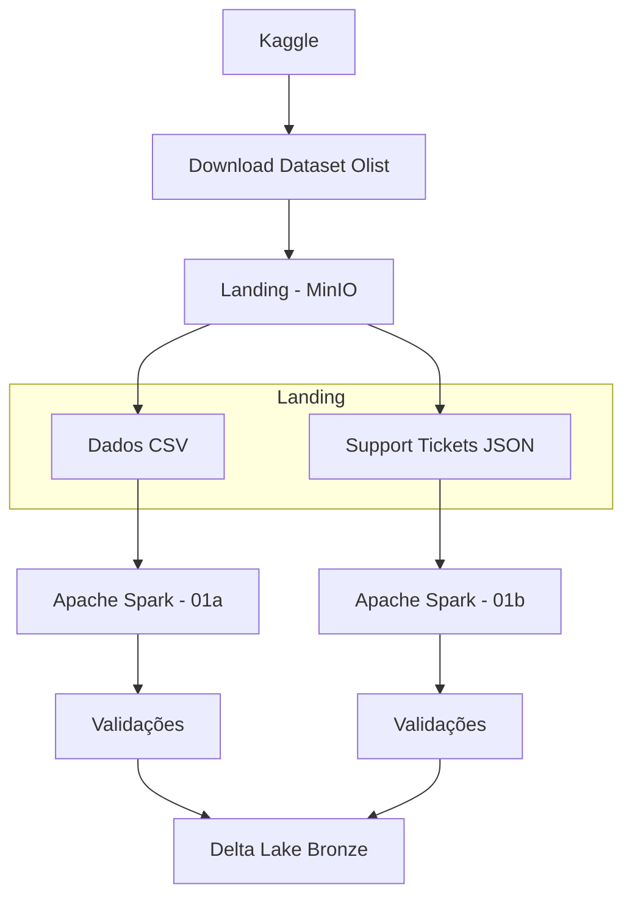

# Camada Bronze

Documentação da camada Bronze da pipeline.

## Objetivo

A camada Bronze é responsável por armazenar os dados ingeridos da camada Landing com o mínimo de transformação possível, preservando a estrutura original da fonte e adicionando metadados técnicos de ingestão.

Nesta etapa, dois tipos de dados são processados:

- Os **arquivos CSV do Olist** são lidos via Spark e persistidos como tabelas Delta Lake.
- Os **support tickets NoSQL** em formato JSON são convertidos para Delta Lake com validação de schema e rastreabilidade.

Ambos são armazenados no bucket Bronze do MinIO, garantindo padronização de tipos e persistência otimizada para as próximas camadas da arquitetura.

---

## Arquitetura da Carga



---

## Fontes de Dados

### Job 01a — CSVs Olist

| Propriedade | Valor |
|---|---|
| Origem | Landing Zone (MinIO) |
| Formato de Entrada | CSV |
| Arquivos Esperados | 9 tabelas Olist |
| Formato de Saída | Delta Lake |
| Destino | Bucket Bronze |

### Job 01b — Support Tickets NoSQL

| Propriedade | Valor |
|---|---|
| Origem | Landing Zone (MinIO) |
| Formato de Entrada | JSON |
| Arquivo Esperado | `reviews_nosql.json` |
| Formato de Saída | Delta Lake |
| Destino | Bucket Bronze |

---

## Jobs de Ingestão

### `notebooks/01a_landing_to_bronze.ipynb`

Lê os 9 arquivos CSV do bucket `landing` e persiste cada um como uma tabela Delta separada no bucket `bronze`.

**Fluxo de execução:**

1. Carrega as variáveis de ambiente do arquivo `.env`.
2. Inicializa a SparkSession com suporte ao Delta Lake e integração S3A para MinIO.
3. Para cada tabela em `EXPECTED_TABLES`, lê o CSV correspondente do bucket `landing`.
4. Adiciona metadados de ingestão (`_ingestion_timestamp`, `_source_file`).
5. Persiste em formato Delta no bucket `bronze`.
6. Verifica o histórico Delta de cada tabela após a escrita.
7. Encerra a SparkSession.

**Orquestração via Papermill / Airflow:**

```bash
papermill notebooks/01a_landing_to_bronze.ipynb output.ipynb \
    -p landing_bucket landing \
    -p bronze_bucket bronze
```

**Tabelas ingeridas:**

| Tabela | Caminho no Bronze |
|---|---|
| `olist_customers_dataset` | `s3a://bronze/olist_customers_dataset` |
| `olist_geolocation_dataset` | `s3a://bronze/olist_geolocation_dataset` |
| `olist_order_items_dataset` | `s3a://bronze/olist_order_items_dataset` |
| `olist_order_payments_dataset` | `s3a://bronze/olist_order_payments_dataset` |
| `olist_order_reviews_dataset` | `s3a://bronze/olist_order_reviews_dataset` |
| `olist_orders_dataset` | `s3a://bronze/olist_orders_dataset` |
| `olist_products_dataset` | `s3a://bronze/olist_products_dataset` |
| `olist_sellers_dataset` | `s3a://bronze/olist_sellers_dataset` |
| `product_category_name_translation` | `s3a://bronze/product_category_name_translation` |

---

### `notebooks/01b_nosql_to_bronze.ipynb`

Lê o arquivo `reviews_nosql.json` do bucket `landing` e persiste como tabela Delta no bucket `bronze`.

**Fluxo de execução:**

1. Carrega as variáveis de ambiente do arquivo `.env`.
2. Cria a conexão com o MinIO via boto3.
3. Localiza o arquivo `reviews_nosql.json` no prefixo `nosql/`.
4. Inicializa a SparkSession com suporte ao Delta Lake e S3A.
5. Lê o JSON e converte os campos de timestamp (`opened_at`, `closed_at`, `created_at`).
6. Adiciona metadados de ingestão (`_ingestion_timestamp`, `_source_file`).
7. Detecta o shape do documento (support tickets ou reviews).
8. Executa validações de qualidade no DataFrame.
9. Persiste em Delta Lake no bucket `bronze`.
10. Relê a tabela Delta e revalida o schema persistido.
11. Gera resumo da execução.

**Orquestração via Papermill / Airflow:**

```bash
papermill notebooks/01b_nosql_to_bronze.ipynb output.ipynb \
    -p input_bucket landing \
    -p output_bucket bronze \
    -p output_prefix reviews_nosql
```

---

## Transformações Aplicadas

A camada Bronze realiza apenas transformações estruturais necessárias para garantir consistência e rastreabilidade.

### 1. Leitura com Inferência de Schema (Job 01b)

O Spark lê o JSON com inferência automática de schema, mantendo a estrutura original dos documentos NoSQL — incluindo campos aninhados (`agent`, `resolution`) e arrays (`messages`).

```python
source_df = spark.read.option("multiLine", True).json(input_path)
```

---

### 2. Conversão de Timestamps

Os campos de data/hora chegam como texto no JSON e são convertidos para `TimestampType`.

```python
def parse_timestamp_if_present(df, column_name: str):
    if column_name not in df.columns:
        return df
    return df.withColumn(column_name, F.to_timestamp(column_name, TIMESTAMP_PATTERN))
```

Campos convertidos: `opened_at`, `closed_at`, `created_at`.

Formato esperado:

```text
2025-01-10T15:30:00Z
```

---

### 3. Inclusão de Metadados de Ingestão

Para aumentar a rastreabilidade da carga, são adicionados dois campos técnicos em todos os jobs.

```python
.withColumn("_ingestion_timestamp", F.current_timestamp())
.withColumn("_source_file", F.input_file_name())
```

| Campo | Descrição |
|---|---|
| `_ingestion_timestamp` | Data e hora da carga |
| `_source_file` | Arquivo utilizado na ingestão |

---

### 4. Preservação de Campos Aninhados

Os campos `agent`, `resolution` e `messages` mantêm sua estrutura original no Bronze.

- `agent` → `StructType`
- `resolution` → `StructType`
- `messages` → `ArrayType`

Não é realizada explosão (`explode`) nem normalização nesta etapa, seguindo o princípio de mínima transformação da camada Bronze.

Exemplo de `messages`:

```json
[
  {
    "message_id": "sup_abc123_msg_001",
    "sender": "customer",
    "sent_at": "2017-03-15T10:00:00Z",
    "body": "Preciso de ajuda com o meu pedido."
  },
  {
    "message_id": "sup_abc123_msg_002",
    "sender": "support_agent",
    "sent_at": "2017-03-15T10:45:00Z",
    "body": "Analisamos e enviamos as orientações necessárias."
  }
]
```

---

### 5. Persistência em Delta Lake

Após as validações, os dados são persistidos em formato Delta.

```python
df.write.format("delta")
  .mode(write_mode)
  .option("overwriteSchema", "true")
  .save(output_path)
```

Benefícios do Delta Lake:

* Schema enforcement
* Versionamento
* Suporte a ACID
* Melhor integração com Spark
* Preparação para as camadas Silver e Gold

---

## Schema Bronze

### Tabelas CSV Olist

Cada tabela mantém o schema original do CSV, acrescido dos metadados:

| Campo | Tipo | Descrição |
|---|---|---|
| *(colunas originais do CSV)* | *(inferido)* | Preservadas sem alteração |
| `_ingestion_timestamp` | timestamp | Data e hora da carga |
| `_source_file` | string | Nome do arquivo de origem |

---

### Tabela `reviews_nosql` (Support Tickets)

| Campo | Tipo | Obrigatório |
|---|---|---|
| `ticket_id` | string | Sim |
| `order_id` | string | Sim |
| `customer_id` | string | Sim |
| `channel` | string | Sim |
| `issue_type` | string | Sim |
| `priority` | string | Sim |
| `status` | string | Sim |
| `opened_at` | timestamp | Sim |
| `first_response_minutes` | int | Sim |
| `sla_target_hours` | int | Sim |
| `agent` | struct | Sim |
| `closed_at` | timestamp | Não |
| `resolution` | struct | Sim |
| `messages` | array | Sim |
| `_ingestion_timestamp` | timestamp | Sim |
| `_source_file` | string | Sim |

---

## Estrutura no MinIO

Após a execução dos dois jobs, o bucket Bronze contém:

```text
bronze/
├── olist_customers_dataset/
│   ├── _delta_log/
│   └── part-*.parquet
├── olist_geolocation_dataset/
├── olist_order_items_dataset/
├── olist_order_payments_dataset/
├── olist_order_reviews_dataset/
├── olist_orders_dataset/
├── olist_products_dataset/
├── olist_sellers_dataset/
├── product_category_name_translation/
└── reviews_nosql/
    ├── _delta_log/
    └── part-*.parquet
```

---

## Qualidade de Dados

### Job 01a — CSVs Olist

Após a escrita de cada tabela Delta, o histórico é verificado via `DeltaTable.history()` para confirmar que a operação foi registrada corretamente.

```python
dt = DeltaTable.forPath(spark, target_path)
history = dt.history(1).select("version", "timestamp", "operation").collect()
```

Se qualquer tabela falhar na ingestão, o job finaliza com `RuntimeError` indicando quantas tabelas foram processadas com sucesso.

---

### Job 01b — Support Tickets NoSQL

#### Existência de Dados

```python
if not df.take(1):
    raise ValueError("The NoSQL source produced zero rows.")
```

#### Detecção de Shape do Documento

O job identifica automaticamente se o documento é um support ticket ou um review, validando os campos presentes.

```python
def detect_document_shape(df) -> str:
    columns = set(df.columns)
    if {"ticket_id", "issue_type", "messages", "agent", "resolution"}.issubset(columns):
        return "support_tickets"
    if {"review_id", "sentiment", "comment_text", "tags", "created_at"}.issubset(columns):
        return "reviews"
    raise ValueError(f"Unsupported NoSQL document shape. Columns found: {sorted(columns)}")
```

#### Validação de Tipos dos Campos Aninhados

```python
if not isinstance(field_map["agent"], StructType):
    raise TypeError("Column 'agent' must be preserved as StructType in Bronze.")
if not isinstance(field_map["resolution"], StructType):
    raise TypeError("Column 'resolution' must be preserved as StructType in Bronze.")
if not isinstance(field_map["messages"], ArrayType):
    raise TypeError("Column 'messages' must be preserved as ArrayType in Bronze.")
```

#### Validação de Timestamps

```python
if not isinstance(field_map["opened_at"], TimestampType):
    raise TypeError("Column 'opened_at' must be stored as TimestampType in Bronze.")
```

#### Verificação de Campos Obrigatórios

Não são permitidos valores nulos em:

* `ticket_id`
* `order_id`
* `customer_id`
* `opened_at`
* `_source_file`
* `messages` (também não pode ser array vazio)

```python
df.filter(
    F.col("ticket_id").isNull()
    | F.col("order_id").isNull()
    | F.col("customer_id").isNull()
    | F.col("opened_at").isNull()
    | F.col("_source_file").isNull()
    | F.col("messages").isNull()
    | (F.size("messages") == 0)
)
```

#### Validação Pós-Escrita

Após persistir os dados, a tabela Delta é relida e todas as validações são executadas novamente para garantir que o schema persistido permanece íntegro.

```python
persisted_df = read_back_delta(spark, output_path)
persisted_document_shape = validate_bronze_dataframe(persisted_df)
if persisted_document_shape != document_shape:
    raise ValueError("Persisted Delta table shape differs from the source DataFrame shape.")
```

---

## Resultado

Ao final da execução dos dois jobs:

* Os 9 CSVs do Olist estão persistidos como tabelas Delta no bucket `bronze`.
* Os support tickets NoSQL estão persistidos como tabela Delta em `bronze/reviews_nosql`.
* Todos os dados possuem metadados de rastreabilidade (`_ingestion_timestamp`, `_source_file`).
* As validações garantem a qualidade e integridade dos dados.

Os dados ficam disponíveis na camada Bronze para consumo pelas etapas da camada Silver.