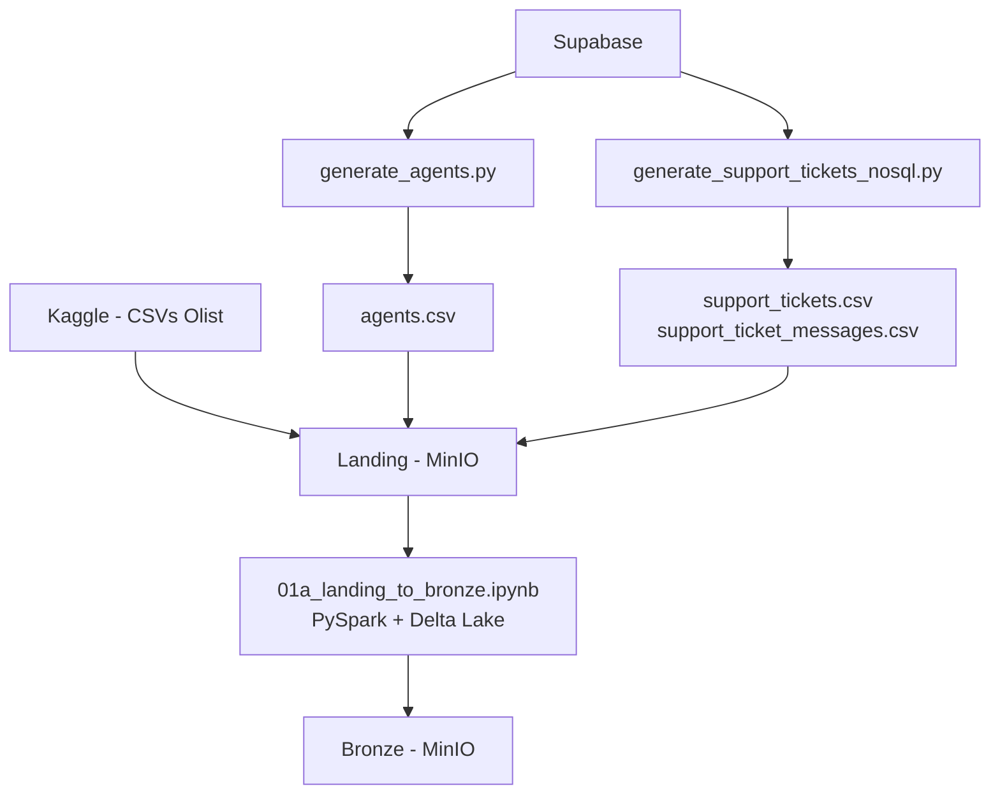

# Camada Bronze

Documentação da camada Bronze da pipeline.

## Objetivo

A camada Bronze é responsável por armazenar os dados ingeridos da camada Landing com o mínimo de transformação possível, preservando a estrutura original da fonte e adicionando metadados técnicos de ingestão.

Nesta etapa, todas as tabelas — tanto os CSVs do Olist quanto as tabelas de suporte exportadas do Supabase — são lidas via PySpark e persistidas como Delta Lake no bucket Bronze do MinIO.

---

## Arquitetura da Carga



---

## Fonte de Dados

Todas as 12 tabelas são lidas do bucket `landing` no MinIO como CSV e persistidas como Delta Lake no bucket `bronze`.

| Tabela | Origem |
|---|---|
| `olist_customers_dataset` | Kaggle / Olist |
| `olist_geolocation_dataset` | Kaggle / Olist |
| `olist_order_items_dataset` | Kaggle / Olist |
| `olist_order_payments_dataset` | Kaggle / Olist |
| `olist_order_reviews_dataset` | Kaggle / Olist |
| `olist_orders_dataset` | Kaggle / Olist |
| `olist_products_dataset` | Kaggle / Olist |
| `olist_sellers_dataset` | Kaggle / Olist |
| `product_category_name_translation` | Kaggle / Olist |
| `agents` | Supabase → `generate_agents.py` |
| `support_tickets` | Supabase → `generate_support_tickets_nosql.py` |
| `support_ticket_messages` | Supabase → `generate_support_tickets_nosql.py` |

---

## Job de Ingestão

### `notebooks/01a_landing_to_bronze.ipynb`

Lê as 12 tabelas CSV do bucket `landing` e persiste cada uma como tabela Delta separada no bucket `bronze`.

**Execução via Papermill:**

```bash
uv run papermill notebooks/01a_landing_to_bronze.ipynb output.ipynb \
    -p landing_bucket landing \
    -p bronze_bucket bronze
```

**Parâmetros:**

| Parâmetro | Padrão | Descrição |
|---|---|---|
| `landing_bucket` | `landing` | Bucket de origem no MinIO |
| `bronze_bucket` | `bronze` | Bucket de destino no MinIO |

---

## Fluxo de Execução

1. Carrega as variáveis de ambiente do arquivo `.env`.
2. Inicializa a SparkSession com suporte ao Delta Lake e integração S3A para MinIO.
3. Para cada uma das 12 tabelas em `EXPECTED_TABLES`:
   - Lê o CSV correspondente do bucket `landing`.
   - Adiciona os metadados de ingestão (`_ingestion_timestamp`, `_source_file`).
   - Persiste em formato Delta no bucket `bronze`.
4. Verifica o histórico Delta de cada tabela após a escrita via `DeltaTable.history()`.
5. Encerra a SparkSession.
6. Lança `RuntimeError` se qualquer tabela falhar.

---

## Transformações Aplicadas

A camada Bronze realiza apenas transformações estruturais mínimas.

### 1. Leitura com Inferência de Schema

O Spark lê cada CSV com inferência automática de tipos, preservando os dados originais.

```python
df = (
    spark.read
    .option("header", "true")
    .option("inferSchema", "true")
    .option("multiLine", "true")
    .option("escape", '"')
    .csv(source_path)
)
```

### 2. Adição de Metadados de Ingestão

Para garantir rastreabilidade, dois campos técnicos são adicionados a todas as tabelas.

```python
df = (
    df
    .withColumn("_ingestion_timestamp", F.current_timestamp())
    .withColumn("_source_file", F.lit(f"{table_name}.csv"))
)
```

| Campo | Tipo | Descrição |
|---|---|---|
| `_ingestion_timestamp` | timestamp | Data e hora da carga |
| `_source_file` | string | Nome do arquivo CSV de origem |

### 3. Persistência em Delta Lake

```python
df.write
  .format("delta")
  .mode("overwrite")
  .option("overwriteSchema", "true")
  .save(target_path)
```

Benefícios do Delta Lake nesta etapa: schema enforcement, versionamento e suporte a ACID.

---

## Verificação das Tabelas Delta

Após a escrita de cada tabela, o job verifica o histórico Delta para confirmar que a operação foi registrada.

```python
dt = DeltaTable.forPath(spark, target_path)
history = dt.history(1).select("version", "timestamp", "operation").collect()
```

---

## Schema Bronze

Cada tabela mantém o schema original do CSV acrescido dos metadados:

| Campo | Tipo | Descrição |
|---|---|---|
| *(colunas originais do CSV)* | *(inferido)* | Preservadas sem alteração |
| `_ingestion_timestamp` | timestamp | Data e hora da carga |
| `_source_file` | string | Nome do arquivo de origem |

### Schema — `agents`

| Campo | Tipo | Obrigatório |
|---|---|---|
| `agent_id` | string | Sim |
| `alias` | string | Sim |
| `team` | string | Sim |
| `_ingestion_timestamp` | timestamp | Sim |
| `_source_file` | string | Sim |

### Schema — `support_tickets`

| Campo | Tipo | Obrigatório |
|---|---|---|
| `ticket_id` | string | Sim |
| `order_id` | string | Sim |
| `customer_id` | string | Sim |
| `agent_id` | string | Sim |
| `channel` | string | Sim |
| `issue_type` | string | Sim |
| `priority` | string | Sim |
| `status` | string | Sim |
| `opened_at` | string | Sim |
| `first_response_minutes` | int | Sim |
| `sla_target_hours` | int | Sim |
| `closed_at` | string | Não |
| `resolution_outcome` | string | Não |
| `resolution_hours` | int | Não |
| `requires_seller_action` | boolean | Não |
| `resolution_compensation` | string | Não |
| `_ingestion_timestamp` | timestamp | Sim |
| `_source_file` | string | Sim |

### Schema — `support_ticket_messages`

| Campo | Tipo | Obrigatório |
|---|---|---|
| `message_id` | string | Sim |
| `ticket_id` | string | Sim |
| `sender` | string | Sim |
| `sent_at` | string | Sim |
| `body` | string | Sim |
| `_ingestion_timestamp` | timestamp | Sim |
| `_source_file` | string | Sim |

---

## Estrutura no MinIO

```text
bronze/
├── olist_customers_dataset/
│   ├── _delta_log/
│   └── part-*.parquet
├── olist_geolocation_dataset/
├── olist_order_items_dataset/
├── olist_order_payments_dataset/
├── olist_order_reviews_dataset/
├── olist_orders_dataset/
├── olist_products_dataset/
├── olist_sellers_dataset/
├── product_category_name_translation/
├── agents/
├── support_tickets/
└── support_ticket_messages/
```

---

## Tratamento de Erros

- Se qualquer tabela falhar na ingestão, o erro é logado e o job continua para as demais.
- Ao final, se o número de tabelas processadas com sucesso for menor que 12, o job lança `RuntimeError`:

```python
if success_count < len(EXPECTED_TABLES):
    raise RuntimeError(
        f"Nem todas as tabelas foram ingeridas com sucesso! "
        f"({success_count}/{len(EXPECTED_TABLES)})"
    )
```

---

## Resultado

Ao final da execução, as 12 tabelas ficam disponíveis no bucket `bronze` em formato Delta Lake, prontas para o processamento da camada Silver.