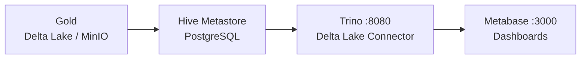

# Dashboard

Documentação dos dashboards e visualizações do projeto.

## Visão Geral

O projeto utiliza **Metabase** como ferramenta de BI, conectado às tabelas da camada Gold via **Trino**. O Trino virtualiza as tabelas Delta Lake armazenadas no MinIO sem necessidade de movimentação de dados, expondo-as como SQL padrão para o Metabase.



---

## Arquitetura de Serviços

Todos os serviços sobem via Docker Compose na rede interna `lakehouse`.

| Serviço | Imagem | Porta | Função |
|---|---|---|---|
| `minio` | `minio/minio:latest` | `9000` / `9001` | Armazenamento dos buckets Delta Lake |
| `postgres-hms` | `postgres:15-alpine` | interno | Backend do Hive Metastore |
| `hive-metastore` | `apache/hive:3.1.3` | `9083` | Catálogo de tabelas para o Trino |
| `trino` | `trinodb/trino:435` | `8080` | Query engine sobre as tabelas Delta |
| `metabase` | `metabase/metabase:latest` | `3000` | Dashboards e visualizações |

### Ordem de inicialização

```
postgres-hms (healthy)
    └─► hive-metastore (healthy)
            └─► trino (healthy)

minio (healthy)
    └─► minio-init (cria os buckets)
```

---

## Configuração do Trino

### Conector Delta Lake (`catalog/delta.properties`)

O conector Delta Lake aponta para o Hive Metastore como catálogo de tabelas e para o MinIO como storage S3-compatível.

```properties
connector.name=delta_lake
hive.metastore.uri=thrift://hive-metastore:9083
hive.s3.endpoint=http://minio:9000
hive.s3.path-style-access=true
hive.s3.aws-access-key=minioadmin
hive.s3.aws-secret-key=minioadmin
hive.s3.ssl.enabled=false
delta.enable-non-concurrent-writes=true
delta.register-table-procedure.enabled=true
```

> `delta.register-table-procedure.enabled=true` permite registrar as tabelas Delta Lake do bucket `gold` no Hive Metastore via `CALL delta.system.register_table(...)` sem precisar recriar as tabelas.

### Conector Hive (`catalog/hive.properties`)

```properties
connector.name=hive
hive.metastore.uri=thrift://hive-metastore:9083
hive.s3.endpoint=http://minio:9000
hive.s3.aws-access-key=minioadmin
hive.s3.aws-secret-key=minioadmin
hive.s3.path-style-access=true
hive.s3.ssl.enabled=false
```

### JVM (`jvm.config`)

```
-XX:+HeapDumpOnOutOfMemoryError
-XX:+ExitOnOutOfMemoryError
-Djdk.attach.allowAttachSelf=true
-XX:ReservedCodeCacheSize=512M
-XX:PerMethodRecompilationCutoff=10000
-XX:PerBytecodeRecompilationCutoff=10000
```

---

## Registrando as Tabelas Gold no Trino

Após a pipeline Gold ser executada, as tabelas Delta Lake precisam ser registradas no Hive Metastore para ficarem visíveis no Trino. Execute via CLI do Trino ou pela interface web em `http://localhost:8080`:

```sql
-- Criar schema
CREATE SCHEMA IF NOT EXISTS delta.gold
WITH (location = 's3a://gold/');

-- Registrar cada tabela
CALL delta.system.register_table(
  schema_name => 'gold',
  table_name  => 'fact_orders',
  table_location => 's3a://gold/fact_orders'
);

CALL delta.system.register_table(
  schema_name => 'gold',
  table_name  => 'fact_reviews',
  table_location => 's3a://gold/fact_reviews'
);

CALL delta.system.register_table(
  schema_name => 'gold',
  table_name  => 'fact_support_tickets',
  table_location => 's3a://gold/fact_support_tickets'
);

CALL delta.system.register_table(schema_name => 'gold', table_name => 'dim_date',     table_location => 's3a://gold/dim_date');
CALL delta.system.register_table(schema_name => 'gold', table_name => 'dim_customer', table_location => 's3a://gold/dim_customer');
CALL delta.system.register_table(schema_name => 'gold', table_name => 'dim_seller',   table_location => 's3a://gold/dim_seller');
CALL delta.system.register_table(schema_name => 'gold', table_name => 'dim_product',  table_location => 's3a://gold/dim_product');
CALL delta.system.register_table(schema_name => 'gold', table_name => 'dim_agent',    table_location => 's3a://gold/dim_agent');
```

---

## Acesso

### Metabase

| Campo | Valor |
|---|---|
| URL | `http://localhost:3000` |
| Usuário padrão | configurado no primeiro acesso |
| Timezone | `America/Sao_Paulo` |
| Banco interno | H2 (persistido em volume Docker `metabase-data`) |

Na configuração inicial do Metabase, adicione uma conexão com os seguintes dados:

| Campo | Valor |
|---|---|
| Tipo de banco | Presto/Trino |
| Host | `trino` (ou `localhost` fora do Docker) |
| Porta | `8080` |
| Catálogo | `delta` |
| Schema | `gold` |

### Trino Web UI

| Campo | Valor |
|---|---|
| URL | `http://localhost:8080` |
| Usuário | qualquer string (sem senha no ambiente local) |

### MinIO Console

| Campo | Valor |
|---|---|
| URL | `http://localhost:9001` |
| Usuário | `minioadmin` (ou valor de `MINIO_ACCESS_KEY` no `.env`) |
| Senha | `minioadmin` (ou valor de `MINIO_SECRET_KEY` no `.env`) |

---

## Dashboards

O projeto possui um dashboard principal com 6 cards analíticos, todos consumindo as tabelas da camada Gold via Trino.

| Card | Nome | Tabela principal | Descrição |
|---|---|---|---|
| `40` | Total Revenue | `fact_orders` | Receita total dos pedidos entregues |
| `41` | Average Delivery Time | `fact_orders` | Tempo médio de entrega em dias |
| `42` | Open Orders | `fact_orders` | Pedidos pendentes (não cancelados e sem entrega) |
| `46` | Average Rating | `fact_reviews` | Nota média das avaliações de clientes |
| `44` | Rating x Delivery Time | `fact_orders` + `fact_reviews` | Correlação entre nota e tempo de entrega |
| `45` | Tickets resolvidos / tempo | `fact_support_tickets` | Volume de tickets resolvidos ao longo do tempo |

---

## Queries de Referência

As queries abaixo correspondem à lógica dos cards do dashboard e podem ser executadas diretamente no Trino.

### Total Revenue

```sql
SELECT
    ROUND(SUM(total_value), 2) AS receita_total
FROM delta.gold.fact_orders
WHERE is_delivered = true;
```

### Average Delivery Time

```sql
SELECT
    ROUND(AVG(delivery_days), 1) AS tempo_medio_entrega_dias
FROM delta.gold.fact_orders
WHERE is_delivered = true
  AND delivery_days IS NOT NULL;
```

### Open Orders

```sql
SELECT
    COUNT(DISTINCT order_id) AS pedidos_pendentes
FROM delta.gold.fact_orders
WHERE is_pending = true;
```

### Average Rating

```sql
SELECT
    ROUND(AVG(CAST(review_score AS DOUBLE)), 2) AS nota_media
FROM delta.gold.fact_reviews;
```

### Rating x Delivery Time

```sql
SELECT
    o.delivery_days,
    ROUND(AVG(CAST(r.review_score AS DOUBLE)), 2) AS nota_media
FROM delta.gold.fact_orders o
JOIN delta.gold.fact_reviews r ON o.order_id = r.order_id
WHERE o.is_delivered = true
  AND o.delivery_days IS NOT NULL
GROUP BY o.delivery_days
ORDER BY o.delivery_days;
```

### Tickets resolvidos / tempo

```sql
SELECT
    d.year,
    d.month,
    d.month_name,
    COUNT(*) AS tickets_resolvidos
FROM delta.gold.fact_support_tickets t
JOIN delta.gold.dim_date d ON t.date_id = d.date_id
WHERE t.is_solved = true
GROUP BY d.year, d.month, d.month_name
ORDER BY d.year, d.month;
```

---

## Buckets criados automaticamente

O serviço `minio-init` cria os buckets automaticamente na inicialização:

```bash
mc mb --ignore-existing local/landing
mc mb --ignore-existing local/bronze
mc mb --ignore-existing local/silver
mc mb --ignore-existing local/gold
```