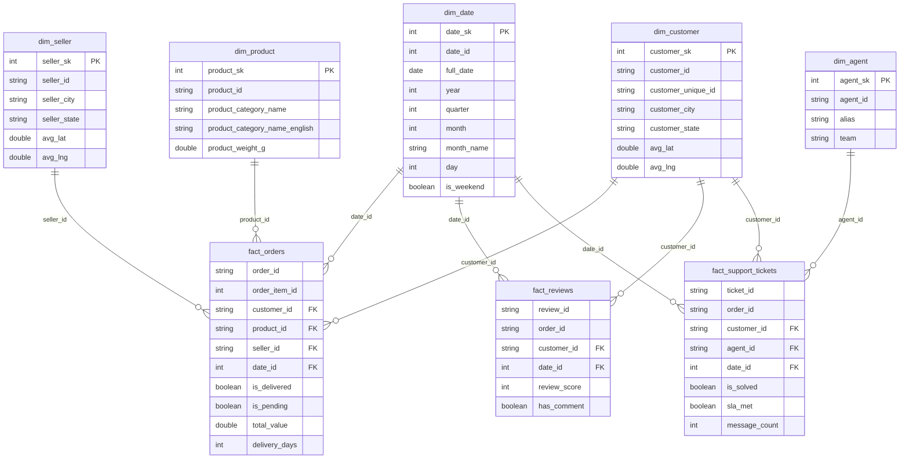

# Camada Gold

Documentação da camada gold da pipeline.

## Objetivo

A camada Gold é responsável por construir o **modelo dimensional estrela** a partir dos dados limpos da camada Silver, disponibilizando tabelas analíticas otimizadas para consumo pelo Metabase e outras ferramentas de BI.

Nesta etapa são realizadas as transformações de negócio: joins entre tabelas, criação de surrogate keys, cálculo de flags e métricas operacionais.

---

## Formato e Tabelas Presentes

- **Formato de entrada:** Delta Lake (bucket `silver`)
- **Formato de saída:** Delta Lake (bucket `gold`)
- **Total de tabelas:** 8 (5 dimensões + 3 fatos)

| Tabela | Tipo | Grain |
|---|---|---|
| `dim_date` | Dimensão | Um registro por dia do calendário |
| `dim_customer` | Dimensão | Um registro por `customer_id` |
| `dim_seller` | Dimensão | Um registro por `seller_id` |
| `dim_product` | Dimensão | Um registro por `product_id` |
| `dim_agent` | Dimensão | Um registro por `agent_id` |
| `fact_orders` | Fato | Um registro por item de pedido (`order_id` + `order_item_id`) |
| `fact_reviews` | Fato | Um registro por avaliação (`review_id`) |
| `fact_support_tickets` | Fato | Um registro por ticket de suporte (`ticket_id`) |

---

## Star Schema vs OBT

O projeto adota **Star Schema** em vez de One Big Table (OBT) pelos seguintes motivos:

**Star Schema foi escolhido porque:**

- As dimensões (`dim_customer`, `dim_seller`, `dim_product`) são reutilizadas por múltiplas tabelas fato, evitando redundância de dados.
- O Metabase se integra naturalmente com modelos dimensionais, permitindo joins visuais entre fatos e dimensões sem SQL manual.
- O modelo estrela facilita a adição de novas tabelas fato no futuro (ex: `fact_payments`) sem necessidade de reescrever toda a estrutura.
- Dimensões como `dim_date` e `dim_customer` enriquecem os dados com atributos calculados (coordenadas geográficas, flags de fim de semana) que seriam repetidos desnecessariamente em uma OBT.

**OBT seria adequado se:**
- Houvesse apenas uma tabela fato e o modelo não fosse expandido.
- A ferramenta de BI não suportasse joins, exigindo uma única tabela plana.

---

## Diagrama ER



---

## Dimensões

### `dim_date`

Calendário gerado automaticamente a partir do intervalo de `order_purchase_timestamp` da camada Silver.

```python
dim_date = (
    spark.range(n_days)
    .select(F.expr(f"date_add(to_date('{start_str}'), CAST(id AS INT))").alias("full_date"))
    .select(
        (F.year("full_date") * 10000 + F.month("full_date") * 100 + F.dayofmonth("full_date"))
            .cast(T.IntegerType()).alias("date_id"),
        F.col("full_date"),
        F.year("full_date").alias("year"),
        F.quarter("full_date").alias("quarter"),
        F.month("full_date").alias("month"),
        F.date_format("full_date", "MMMM").alias("month_name"),
        F.dayofmonth("full_date").alias("day"),
        F.weekofyear("full_date").alias("week_of_year"),
        (F.dayofweek("full_date").isin([1, 7])).alias("is_weekend"),
    )
    .withColumn("date_sk", F.row_number().over(Window.orderBy("date_id")))
)
```

| Campo | Tipo | Descrição |
|---|---|---|
| `date_sk` | int | Surrogate key |
| `date_id` | int | Chave natural (YYYYMMDD) |
| `full_date` | date | Data completa |
| `year` | int | Ano |
| `quarter` | int | Trimestre |
| `month` | int | Mês |
| `month_name` | string | Nome do mês |
| `day` | int | Dia do mês |
| `week_of_year` | int | Semana do ano |
| `day_of_week` | int | Dia da semana (1=Dom, 7=Sáb) |
| `day_name` | string | Nome do dia |
| `is_weekend` | boolean | True se sábado ou domingo |

---

### `dim_customer`

Clientes enriquecidos com coordenadas geográficas médias por CEP.

```python
geo_agg = geolocation.groupBy("geolocation_zip_code_prefix").agg(
    F.avg("geolocation_lat").alias("avg_lat"),
    F.avg("geolocation_lng").alias("avg_lng"),
)

dim_customer = (
    customers
    .join(
        geo_agg,
        customers["customer_zip_code_prefix"].cast(T.IntegerType())
        == geo_agg["geolocation_zip_code_prefix"],
        "left",
    )
    .select(
        "customer_id", "customer_unique_id",
        "customer_zip_code_prefix", "customer_city", "customer_state",
        F.round("avg_lat", 6).alias("avg_lat"),
        F.round("avg_lng", 6).alias("avg_lng"),
    )
    .withColumn("customer_sk", F.row_number().over(Window.orderBy("customer_id")))
)
```

| Campo | Tipo | Descrição |
|---|---|---|
| `customer_sk` | int | Surrogate key |
| `customer_id` | string | Chave natural |
| `customer_unique_id` | string | Identificador único do cliente |
| `customer_zip_code_prefix` | string | CEP (5 dígitos) |
| `customer_city` | string | Cidade |
| `customer_state` | string | UF |
| `avg_lat` | double | Latitude média do CEP |
| `avg_lng` | double | Longitude média do CEP |

---

### `dim_seller`

Vendedores enriquecidos com coordenadas geográficas médias por CEP, usando o mesmo `geo_agg` de `dim_customer`.

| Campo | Tipo | Descrição |
|---|---|---|
| `seller_sk` | int | Surrogate key |
| `seller_id` | string | Chave natural |
| `seller_zip_code_prefix` | string | CEP (5 dígitos) |
| `seller_city` | string | Cidade |
| `seller_state` | string | UF |
| `avg_lat` | double | Latitude média do CEP |
| `avg_lng` | double | Longitude média do CEP |

---

### `dim_product`

Produtos com categoria denormalizada — a tradução PT→EN é unida diretamente, sem tabela de categoria separada (decisão de star schema).

```python
dim_product = (
    products
    .join(category_tr, "product_category_name", "left")
    .select(
        "product_id",
        "product_category_name",
        F.coalesce(
            F.col("product_category_name_english"), F.lit("unknown")
        ).alias("product_category_name_english"),
        "product_weight_g", "product_length_cm",
        "product_height_cm", "product_width_cm",
    )
    .withColumn("product_sk", F.row_number().over(Window.orderBy("product_id")))
)
```

| Campo | Tipo | Descrição |
|---|---|---|
| `product_sk` | int | Surrogate key |
| `product_id` | string | Chave natural |
| `product_category_name` | string | Categoria em português |
| `product_category_name_english` | string | Categoria em inglês (`unknown` se não traduzida) |
| `product_weight_g` | double | Peso em gramas |
| `product_length_cm` | double | Comprimento em cm |
| `product_height_cm` | double | Altura em cm |
| `product_width_cm` | double | Largura em cm |

---

### `dim_agent`

Agentes de suporte com suas equipes de atuação.

| Campo | Tipo | Descrição |
|---|---|---|
| `agent_sk` | int | Surrogate key |
| `agent_id` | string | Chave natural |
| `alias` | string | Nome do agente |
| `team` | string | Equipe (logistics, post_sale, payments, orders, seller_ops) |

---

## Tabelas Fato

### `fact_orders`

Grain: **order_item** — uma linha por item de pedido.

```python
fact_orders = (
    order_items
    .join(_orders_slim, "order_id", "inner")
    .withColumn("total_value", F.col("price") + F.col("freight_value"))
    .withColumn("is_delivered", F.col("order_status") == "delivered")
    .withColumn(
        "is_pending",
        (~F.col("order_status").isin("canceled", "unavailable"))
        & F.col("order_delivered_customer_date").isNull(),
    )
    .withColumn(
        "delivery_days",
        F.when(
            F.col("order_delivered_customer_date").isNotNull(),
            F.datediff("order_delivered_customer_date", "order_purchase_timestamp"),
        ).otherwise(F.lit(None).cast(T.IntegerType())),
    )
)
```

| Campo | Tipo | Descrição |
|---|---|---|
| `order_id` | string | ID do pedido |
| `order_item_id` | int | Sequencial do item |
| `customer_id` | string | FK → `dim_customer` |
| `product_id` | string | FK → `dim_product` |
| `seller_id` | string | FK → `dim_seller` |
| `date_id` | int | FK → `dim_date` |
| `order_status` | string | Status do pedido |
| `is_delivered` | boolean | True se status = `delivered` |
| `is_pending` | boolean | True se não cancelado e sem data de entrega |
| `price` | double | Preço do item |
| `freight_value` | double | Frete |
| `total_value` | double | `price + freight_value` |
| `delivery_days` | int | Dias entre compra e entrega |

---

### `fact_reviews`

Grain: **review** — uma linha por avaliação de pedido.

| Campo | Tipo | Descrição |
|---|---|---|
| `review_id` | string | ID da avaliação |
| `order_id` | string | ID do pedido |
| `customer_id` | string | FK → `dim_customer` |
| `date_id` | int | FK → `dim_date` |
| `review_score` | int | Nota de 1 a 5 |
| `has_comment` | boolean | True se há comentário preenchido |

---

### `fact_support_tickets`

Grain: **ticket** — uma linha por ticket de suporte.

```python
fact_support_tickets = (
    tickets
    .join(_msg_count, "ticket_id", "left")
    .withColumn("is_solved", F.col("status").isin("closed", "resolved"))
    .withColumn(
        "sla_met",
        F.when(
            F.col("resolution_hours").isNotNull() & F.col("sla_target_hours").isNotNull(),
            F.col("resolution_hours") <= F.col("sla_target_hours"),
        ).otherwise(F.lit(None).cast(T.BooleanType())),
    )
    .withColumn("message_count", F.coalesce(F.col("message_count"), F.lit(0)))
)
```

| Campo | Tipo | Descrição |
|---|---|---|
| `ticket_id` | string | ID do ticket |
| `order_id` | string | ID do pedido relacionado |
| `customer_id` | string | FK → `dim_customer` |
| `agent_id` | string | FK → `dim_agent` |
| `date_id` | int | FK → `dim_date` |
| `channel` | string | Canal de atendimento |
| `issue_type` | string | Tipo de problema |
| `priority` | string | Prioridade (high, medium, low) |
| `status` | string | Status atual |
| `is_solved` | boolean | True se `closed` ou `resolved` |
| `first_response_minutes` | int | Tempo até a primeira resposta |
| `sla_target_hours` | int | Meta de SLA por prioridade |
| `resolution_hours` | int | Horas até a resolução |
| `sla_met` | boolean | True se `resolution_hours <= sla_target_hours` |
| `requires_seller_action` | boolean | True se envolve ação do vendedor |
| `message_count` | int | Total de mensagens do ticket |

---

## Exemplos de Queries SQL

### KPI 1 — Receita total e tempo médio de entrega por mês

Responde: *Quanto faturamos por mês e qual foi o tempo médio de entrega dos pedidos entregues?*

```sql
SELECT
    d.year,
    d.month,
    d.month_name,
    ROUND(SUM(o.total_value), 2)      AS receita_total,
    ROUND(AVG(o.delivery_days), 1)    AS tempo_medio_entrega_dias,
    COUNT(DISTINCT o.order_id)        AS total_pedidos_entregues
FROM fact_orders o
JOIN dim_date d ON o.date_id = d.date_id
WHERE o.is_delivered = true
GROUP BY d.year, d.month, d.month_name
ORDER BY d.year, d.month;
```

---

### KPI 2 — Taxa de resolução de tickets dentro do SLA por equipe

Responde: *Qual equipe de suporte cumpre melhor o SLA e qual o volume de tickets resolvidos?*

```sql
SELECT
    a.team,
    COUNT(t.ticket_id)                                AS total_tickets,
    SUM(CASE WHEN t.is_solved THEN 1 ELSE 0 END)     AS tickets_resolvidos,
    SUM(CASE WHEN t.sla_met THEN 1 ELSE 0 END)       AS tickets_no_sla,
    ROUND(
        100.0 * SUM(CASE WHEN t.sla_met THEN 1 ELSE 0 END)
        / NULLIF(SUM(CASE WHEN t.is_solved THEN 1 ELSE 0 END), 0),
        1
    )                                                  AS pct_sla_cumprido,
    ROUND(AVG(t.first_response_minutes), 0)           AS tempo_medio_resposta_min
FROM fact_support_tickets t
JOIN dim_agent a ON t.agent_id = a.agent_id
GROUP BY a.team
ORDER BY pct_sla_cumprido DESC;
```

---

## Metadados Gold

Todos as tabelas Gold recebem campos de rastreabilidade adicionados na escrita:

```python
df.withColumn("_gold_timestamp", F.current_timestamp())
  .withColumn("_gold_source", F.lit(silver_bucket))
```

| Campo | Tipo | Descrição |
|---|---|---|
| `_gold_timestamp` | timestamp | Data e hora da escrita Gold |
| `_gold_source` | string | Bucket Silver de origem |

---

## Consumo via Trino

As tabelas Gold não são consumidas diretamente pelo Metabase — o **Trino** atua como query engine entre o MinIO e o Metabase, virtualizando as tabelas Delta Lake via SQL padrão.


O Trino é configurado via Docker Compose com um conector Delta Lake apontando para o bucket `gold` do MinIO. Com isso, o Metabase enxerga as tabelas `dim_date`, `dim_customer`, `fact_orders` e demais como se fossem tabelas SQL convencionais.

**Vantagens dessa abordagem:**

- O Metabase não precisa conhecer o formato Delta nem se conectar diretamente ao MinIO.
- Qualquer ferramenta que suporte JDBC/SQL pode ser conectada ao Trino no lugar do Metabase.
- A camada de armazenamento (MinIO + Delta) fica completamente separada da camada de consumo.

---

## Resultado

Ao final da execução, as 8 tabelas do modelo estrela ficam disponíveis no bucket `gold` em formato Delta Lake, prontas para consumo pelo Metabase e geração dos dashboards analíticos.


