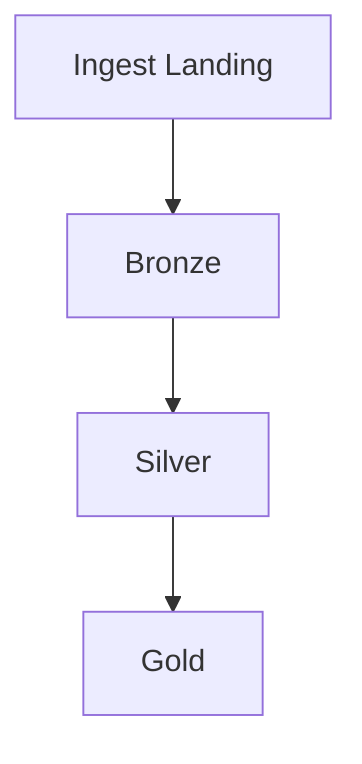

# Jobs

Documentação dos jobs de processamento da pipeline.

## Visão geral

Liste todos os jobs da pipeline, sua ordem de execução e dependências.

## Jobs de ingestão

Scripts em `scripts/ingest/`:

| Job | Script | Descrição | Frequência |
|-----|--------|-----------|------------|
|     |        |           |            |

## Jobs de infraestrutura

Scripts em `scripts/infra/`:

| Job | Script | Descrição |
|-----|--------|-----------|
|     |        |           |

## Execução

Descreva como executar os jobs localmente e em produção.
