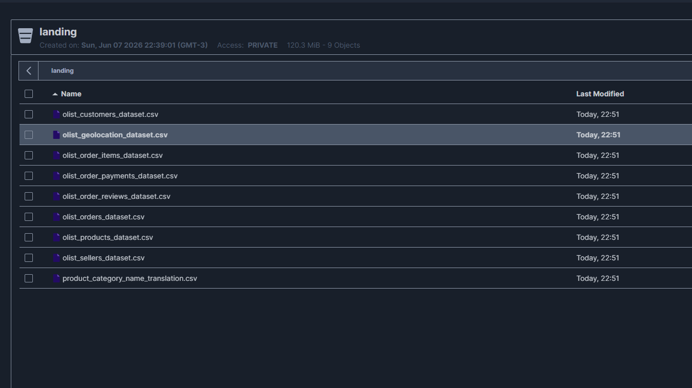

# Camada Landing

Documentação da camada Landing da pipeline.

## Objetivo

<!-- A camada Landing recebe os dados brutos das fontes externas, sem transformações, preservando o formato original-->

A camada **Landing** é o ponto de entrada dos dados no pipeline. Sua principal função é receber e armazenar os dados brutos provenientes das fontes externas, preservando integralmente seu conteúdo e estrutura original.

Nesta etapa não são realizadas transformações, limpezas ou enriquecimentos dos dados. O objetivo é garantir a rastreabilidade das informações recebidas, permitindo auditoria, reprocessamento e recuperação dos dados sempre que necessário.

No contexto deste projeto, a camada Landing armazena os arquivos CSV do dataset **Brazilian E-Commerce Public Dataset by Olist**, obtidos a partir da plataforma Kaggle, servindo como base para as etapas posteriores de processamento nas camadas Bronze, Silver e Gold.

## Fontes de Dados

<!--  Descreva aqui as fontes utilizadas (APIs, Kaggle, arquivos locais, etc.). -->


O projeto utiliza como fonte de dados o conjunto **Brazilian E-Commerce Public Dataset by Olist**, disponibilizado na plataforma Kaggle.

Este dataset contém informações reais de um marketplace brasileiro, abrangendo aproximadamente 100 mil pedidos realizados entre 2016 e 2018. Os dados estão organizados em múltiplos arquivos CSV relacionados entre si, contendo informações sobre:

- Clientes
- Pedidos
- Produtos
- Vendedores
- Pagamentos
- Avaliações
- Geolocalização

A escolha deste conjunto de dados permite simular um ambiente real de Engenharia de Dados, possibilitando a construção de pipelines de ingestão, transformação e modelagem utilizando a arquitetura Medallion (Landing, Bronze, Silver e Gold).

### Dataset

- **Nome:** Brazilian E-Commerce Public Dataset by Olist
- **Fonte:** Kaggle
- **Formato:** CSV
- **Período:** 2016–2018

**Link do dataset:**

<https://www.kaggle.com/datasets/olistbr/brazilian-ecommerce>

### Arquivos utilizados

| Arquivo | Descrição |
|----------|------------|
| `olist_orders_dataset.csv` | Informações dos pedidos |
| `olist_customers_dataset.csv` | Dados dos clientes |
| `olist_products_dataset.csv` | Informações dos produtos |
| `olist_sellers_dataset.csv` | Dados dos vendedores |
| `olist_order_items_dataset.csv` | Itens dos pedidos |
| `olist_order_payments_dataset.csv` | Dados dos pagamentos |
| `olist_order_reviews_dataset.csv` | Avaliações dos clientes |
| `olist_geolocation_dataset.csv` | Dados geográficos dos CEPs |

## Estrutura no MinIO

```
landing/
  ├── olist/
  │   └── 2026-06-08/
  │       ├── olist_customers_dataset.csv
  │       ├── olist_geolocation_dataset.csv
  │       ├── olist_order_items_dataset.csv
  │       ├── olist_order_payments_dataset.csv
  │       ├── olist_order_reviews_dataset.csv
  │       ├── olist_orders_dataset.csv
  │       ├── olist_products_dataset.csv
  │       ├── olist_sellers_dataset.csv
  │       └── product_category_name_translation.csv
```

## Jobs de ingestão

<!--Descreva os scripts em `scripts/ingest/` responsáveis pela carga na camada Landing. -->

O script de ingestão da camada Landing é responsável por realizar a carga inicial dos dados do dataset Olist no Data Lake, armazenando os arquivos brutos no MinIO sem qualquer transformação.


## Fluxo de Execução

1. Carrega as variáveis de ambiente a partir do arquivo `.env`.
2. Realiza a autenticação na API do Kaggle.
3. Baixa o dataset `olistbr/brazilian-ecommerce`.
4. Extrai os arquivos CSV do pacote compactado.
5. Valida a presença dos arquivos esperados.
6. Conecta ao MinIO utilizando a API compatível com S3.
7. Cria o bucket da camada Landing caso ele não exista.
8. Realiza o upload dos arquivos CSV.
9. Verifica se todos os arquivos foram armazenados corretamente.

## Tabelas (9 arquivos CSV)

### 1. `olist_customers_dataset.csv`

Dados de clientes com localização anonimizada.

| Coluna | Tipo | Descrição |
|--------|------|-----------|
| `customer_id` | string | Chave do cliente no pedido (PK) |
| `customer_unique_id` | string | Identificador único do cliente |
| `customer_zip_code_prefix` | string | 5 primeiros dígitos do CEP |
| `customer_city` | string | Cidade do cliente |
| `customer_state` | string | UF do cliente |

---

### 2. `olist_geolocation_dataset.csv`

Coordenadas geográficas associadas a CEPs brasileiros.

| Coluna | Tipo | Descrição |
|--------|------|-----------|
| `geolocation_zip_code_prefix` | string | 5 primeiros dígitos do CEP |
| `geolocation_lat` | float | Latitude |
| `geolocation_lng` | float | Longitude |
| `geolocation_city` | string | Cidade |
| `geolocation_state` | string | UF |

---

### 3. `olist_order_items_dataset.csv`

Itens incluídos em cada pedido.

| Coluna | Tipo | Descrição |
|--------|------|-----------|
| `order_id` | string | ID do pedido (FK → orders) |
| `order_item_id` | int | Sequencial do item dentro do pedido |
| `product_id` | string | ID do produto (FK → products) |
| `seller_id` | string | ID do vendedor (FK → sellers) |
| `shipping_limit_date` | datetime | Data-limite para o vendedor postar |
| `price` | float | Preço do item |
| `freight_value` | float | Valor do frete do item |

---

### 4. `olist_order_payments_dataset.csv`

Informações de pagamento dos pedidos.

| Coluna | Tipo | Descrição |
|--------|------|-----------|
| `order_id` | string | ID do pedido (FK → orders) |
| `payment_sequential` | int | Sequencial do pagamento |
| `payment_type` | string | Tipo (credit_card, boleto, voucher, debit_card) |
| `payment_installments` | int | Número de parcelas |
| `payment_value` | float | Valor do pagamento |

---

### 5. `olist_order_reviews_dataset.csv`

Avaliações feitas pelos clientes após a entrega.

| Coluna | Tipo | Descrição |
|--------|------|-----------|
| `review_id` | string | ID da avaliação (PK) |
| `order_id` | string | ID do pedido (FK → orders) |
| `review_score` | int | Nota de 1 a 5 |
| `review_comment_title` | string | Título do comentário (opcional) |
| `review_comment_message` | string | Corpo do comentário (opcional) |
| `review_creation_date` | datetime | Data de criação da avaliação |
| `review_answer_timestamp` | datetime | Data da resposta ao questionário |

---

### 6. `olist_orders_dataset.csv`

Tabela central de pedidos.

| Coluna | Tipo | Descrição |
|--------|------|-----------|
| `order_id` | string | ID do pedido (PK) |
| `customer_id` | string | ID do cliente (FK → customers) |
| `order_status` | string | Status (delivered, shipped, canceled, …) |
| `order_purchase_timestamp` | datetime | Data/hora da compra |
| `order_approved_at` | datetime | Data/hora da aprovação do pagamento |
| `order_delivered_carrier_date` | datetime | Data de postagem |
| `order_delivered_customer_date` | datetime | Data de entrega ao cliente |
| `order_estimated_delivery_date` | datetime | Data estimada de entrega |

---

### 7. `olist_products_dataset.csv`

Catálogo de produtos vendidos na plataforma.

| Coluna | Tipo | Descrição |
|--------|------|-----------|
| `product_id` | string | ID do produto (PK) |
| `product_category_name` | string | Categoria (em português) |
| `product_name_length` | int | Comprimento do nome |
| `product_description_length` | int | Comprimento da descrição |
| `product_photos_qty` | int | Quantidade de fotos |
| `product_weight_g` | int | Peso em gramas |
| `product_length_cm` | int | Comprimento em cm |
| `product_height_cm` | int | Altura em cm |
| `product_width_cm` | int | Largura em cm |

---

### 8. `olist_sellers_dataset.csv`

Dados de localização dos vendedores.

| Coluna | Tipo | Descrição |
|--------|------|-----------|
| `seller_id` | string | ID do vendedor (PK) |
| `seller_zip_code_prefix` | string | 5 primeiros dígitos do CEP |
| `seller_city` | string | Cidade do vendedor |
| `seller_state` | string | UF do vendedor |

---

### 9. `product_category_name_translation.csv`

Tradução dos nomes de categoria de produto (PT → EN).

| Coluna | Tipo | Descrição |
|--------|------|-----------|
| `product_category_name` | string | Nome da categoria em português |
| `product_category_name_english` | string | Nome da categoria em inglês |

## Estrutura da Camada Landing

Representação visual do fluxo de ingestão dos dados brutos no Data Lake.



## Tratamento de Erros

O script realiza validações para:

* Ausência de credenciais do Kaggle;
* Falha de conexão com o MinIO;
* Erros durante o upload dos arquivos;
* Ausência de arquivos esperados após a extração.

Em caso de erro crítico, a execução é interrompida para evitar cargas incompletas.

## Resultado

Ao final da execução, todos os arquivos do dataset Olist ficam disponíveis na camada Landing, servindo como fonte de dados brutos para os processos subsequentes de transformação e modelagem nas camadas Silver e Gold.

